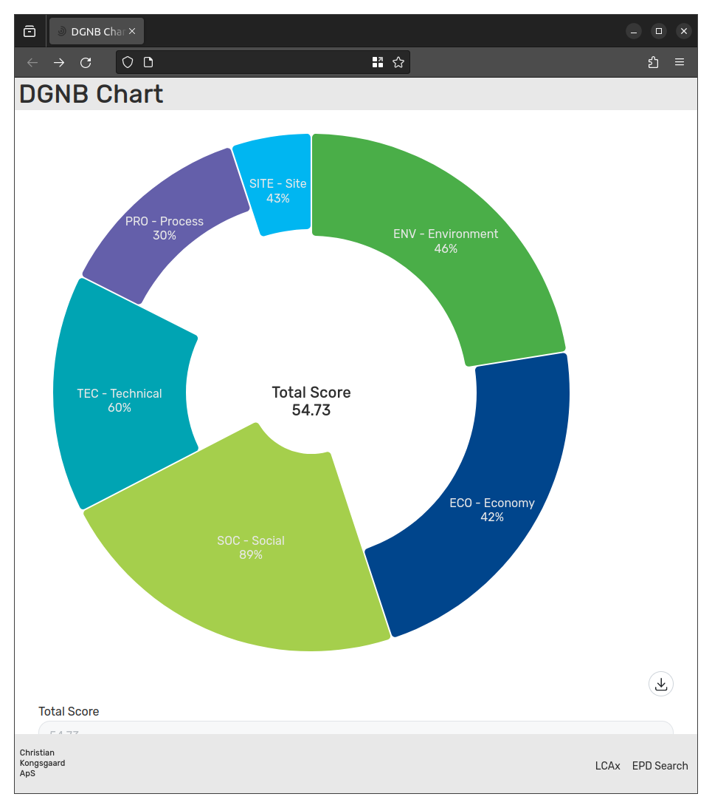

# DGNB Chart App

This app creates an aster plot of your DGNB score.

## Demo
To test it out go to https://dgnb.kongsgaard.eu

## Getting Started

To get started with this application:
1. Clone the repo
2. Make sure you have NodeJS v18 or higher
3. Run `npm install`
4. Run `npm run dev`